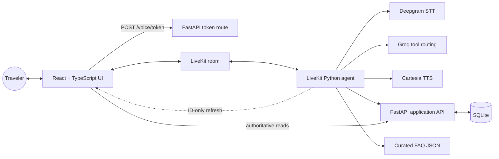

# Waypoint Voice Lab

Waypoint is a reliability-focused realtime voice assistant for a synthetic
travel-application workflow. It combines streaming speech, LLM tool routing,
deterministic business operations, a responsive browser UI, and per-session
observability.

> Probabilistic language handles the conversation. Deterministic code owns
> business truth and side effects.

This repository is a local portfolio project, not a hosted service for real
traveler data. Publishing its source on GitHub does not deploy or expose the
local FastAPI, SQLite, LiveKit room, or provider credentials.

The local V1 workflow is functionally complete and has been exercised through
the custom browser UI with a recorded, full voice session.

[Engineering case study](./project.md) ·
[Blog preparation notes](./docs/BLOG_OUTLINE.md) ·
[Demo recording guide](./docs/DEMO_GUIDE.md) ·
[Architecture](./docs/ARCHITECTURE.md) ·
[Local setup](./docs/LOCAL_DEVELOPMENT.md)

## What the demo does

- Joins a LiveKit room from a React browser client and streams microphone and
  agent audio.
- Transcribes speech with Deepgram, routes typed tools with Groq, and speaks
  responses with Cartesia.
- Reads application status and missing documents from FastAPI and SQLite.
- Prepares a travel-date change, waits for a later deterministic confirmation,
  then performs one idempotent update.
- Creates a human-support request only after the latest finalized user turn
  explicitly asks for a person.
- Sends ID-only refresh hints to the browser, which refetches authoritative
  application data instead of trusting assistant prose.
- Records latency, usage, tools, conversation state, and clean shutdown details
  in ignored local session reports.

The recommended 75–90 second portfolio flow is documented in
[docs/DEMO_GUIDE.md](./docs/DEMO_GUIDE.md). A raw full-flow validation recording
exists; the polished portfolio video is still pending. Publish the approved cut
through YouTube or a GitHub Release rather than committing a large media file
to the repository.

## Architecture



The browser never receives database credentials or reusable LiveKit secrets.
The LLM never writes SQLite directly.

## Reliability boundaries

| Failure mode | Deterministic boundary |
| --- | --- |
| LLM applies a date too early | `apply_pending_travel_date_change` rejects unless a later finalized user turn explicitly confirms the prepared proposal |
| User corrects or vetoes a date | Corrections require preparation again; veto language and replacement dates revoke confirmation |
| Duplicate or uncertain mutation retry | The same pending idempotency key is reused and FastAPI records the result transactionally |
| LLM invents application state | Current state comes from typed FastAPI tools; general answers come from a curated FAQ retriever |
| Accidental human escalation | The tool rejects before interruption locking or HTTP unless the latest user turn explicitly requests a human and uses `user_request` |
| Transcript or data message changes the card | LiveKit messages contain only a canonical ID; the browser validates them and refetches FastAPI |
| Development tests touch real data | Backend tests use temporary SQLite databases initialized through FastAPI lifespan |
| A call sounds correct but acts incorrectly | Session reports retain tool ordering, state, provider usage, latency, and shutdown reason for diagnosis |

## Technology

| Layer | Stack |
| --- | --- |
| Realtime transport | LiveKit Cloud and `livekit-agents` 1.7.0 |
| Speech | Deepgram Nova-3 STT and Cartesia Sonic 3.5 TTS |
| Reasoning/tool routing | Groq `openai/gpt-oss-20b`, low reasoning effort |
| Agent workflow | Python 3.11, typed tools, per-session deterministic state |
| API and persistence | FastAPI, Pydantic, `aiosqlite`, SQLite |
| Frontend | React 19, TypeScript, Vite, LiveKit Client |
| Verification | pytest, provider-backed agent-flow evals, Vitest, TypeScript build |

## Local quick start

Prerequisites: Python 3.11, [`uv`](https://docs.astral.sh/uv/), Node.js,
the LiveKit CLI, a LiveKit project, and provider credentials for Deepgram,
Groq, and Cartesia.

```powershell
git clone https://github.com/Parth-Bisht-227/waypoint-voice-ai.git
Set-Location waypoint-voice-ai
uv sync --locked
npm ci --prefix frontend
Copy-Item agent/.env.example agent/.env.local
```

Fill `agent/.env.local` locally. Never commit it or expose its values through
`VITE_...` variables.

Start the three processes in separate terminals:

```powershell
uv run fastapi dev backend/app/main.py
```

```powershell
lk agent dev agent/agent.py
```

```powershell
npm run dev --prefix frontend
```

Open the Vite URL, normally `http://127.0.0.1:5173`. The complete setup,
troubleshooting, database reset, and test commands are in
[docs/LOCAL_DEVELOPMENT.md](./docs/LOCAL_DEVELOPMENT.md).

## Verification snapshot

Snapshot date: 2026-08-23.

| Suite | Latest result | Notes |
| --- | --- | --- |
| Provider-free Python | 145 passed | Backend, temporary DB isolation, token policy, signals, confirmation/handoff gates, retrieval, observability |
| Groq-backed agent flows | 7 passed | All six tools are safely mocked; the latest complete flow suite passed while remaining provider-variable |
| Frontend unit tests | 10 passed across 3 files | Token parsing, voice boundaries, transcript/state behavior, application validation |
| TypeScript and Vite build | Passed | 45 modules; current main bundle is approximately 723 kB before optional code splitting |

Real custom-UI and LiveKit-UI calls exercised microphone/STT, remote audio,
transcript/state UI, application context changes, confirmed date updates, and
clean disconnect/report writing. One diagnostic LiveKit-UI call measured about
1.85 seconds median end-to-end latency, 0.47 seconds median steady-state LLM
first-token latency, and 0.09 seconds median TTS first-audio latency. That is
one call, not a benchmark; spoken-response duration remained the larger
perceived cost.

Run deterministic and provider-backed checks separately so normal CI does not
depend on provider quota:

```powershell
uv run python -m pytest backend/tests tests evals/test_application_ids.py evals/test_retrieval.py -v
uv run python -m pytest evals/test_agent_flows.py -v
npm test --prefix frontend
npm run check --prefix frontend
npm run build --prefix frontend
```

## Observability and failure analysis

Each completed agent session writes a formatted JSON report under the ignored
`observability/reports/` directory. These reports exposed two otherwise hidden
safety failures during development: an LLM attempted to apply a date in the
same tool loop before confirmation, and another call attempted an unnecessary
handoff during an incomplete date request. Both side effects are now refused
by deterministic Python gates.

Reports can contain transcript content and should be treated as sensitive local
artifacts. Do not commit or publish them without inspection.

## Scope and limitations

- All applications and destinations are synthetic.
- Exact LLM wording/routing, STT accuracy, and network/media latency remain
  provider-variable; deterministic tests are reported separately from live evals.
- Authentication, per-application authorization, token rate limiting, origin
  policy, TLS deployment, and report retention are intentionally not implemented.
- The current fixed demo seed dates will eventually need refreshing.
- Browser automation, narrow-layout accessibility verification, transcript
  coalescing, and LiveKit bundle splitting are useful follow-ups, not blockers
  for the recorded portfolio demo.
- Prompt guidance makes application IDs intelligible, but deterministic TTS-only
  formatting for consistently natural "A P P zero zero four" pronunciation is
  deferred to V1.1.

Do not expose this local V1 as a public service without the production security
controls listed in [docs/ROADMAP.md](./docs/ROADMAP.md).

The source repository may still be public and continue evolving through
branches and pull requests. The author has confirmed ownership of the generated
UI inspiration asset, and the source is licensed under MIT. Repeat the final
secret/generated-artifact scan before changing visibility.

## Documentation

- [Engineering case study](./project.md)
- [Blog preparation notes](./docs/BLOG_OUTLINE.md)
- [Demo recording guide](./docs/DEMO_GUIDE.md)
- [Architecture and trust boundaries](./docs/ARCHITECTURE.md)
- [API, event, and persistence contracts](./docs/CONTRACTS.md)
- [Current evidence and limitations](./docs/CURRENT_STATUS.md)
- [Local development and troubleshooting](./docs/LOCAL_DEVELOPMENT.md)
- [Remaining roadmap](./docs/ROADMAP.md)

## License

Released under the [MIT License](./LICENSE).
