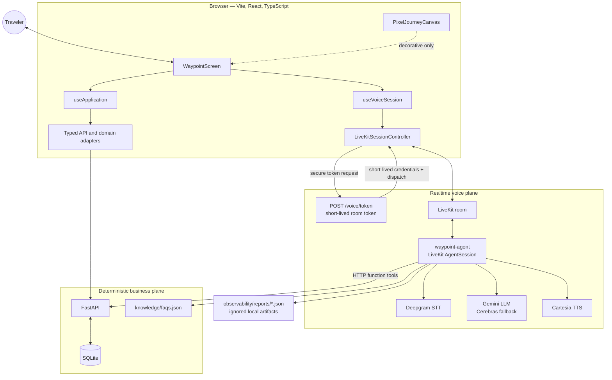
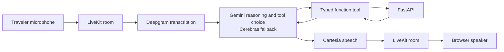
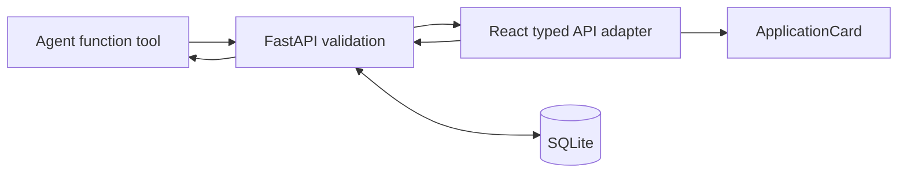
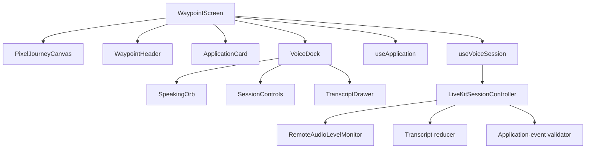
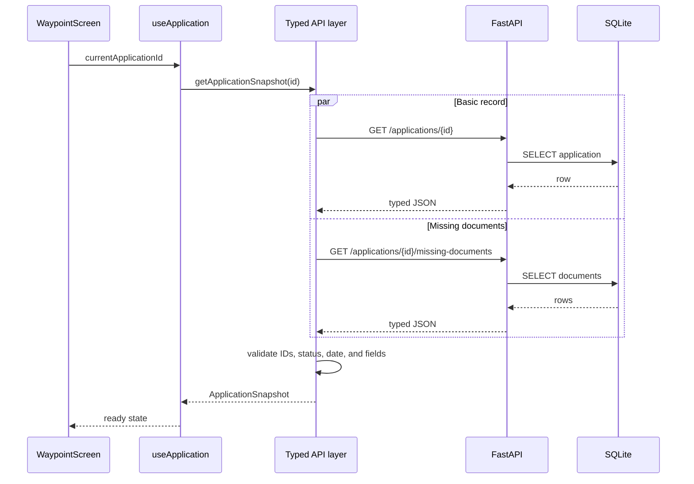
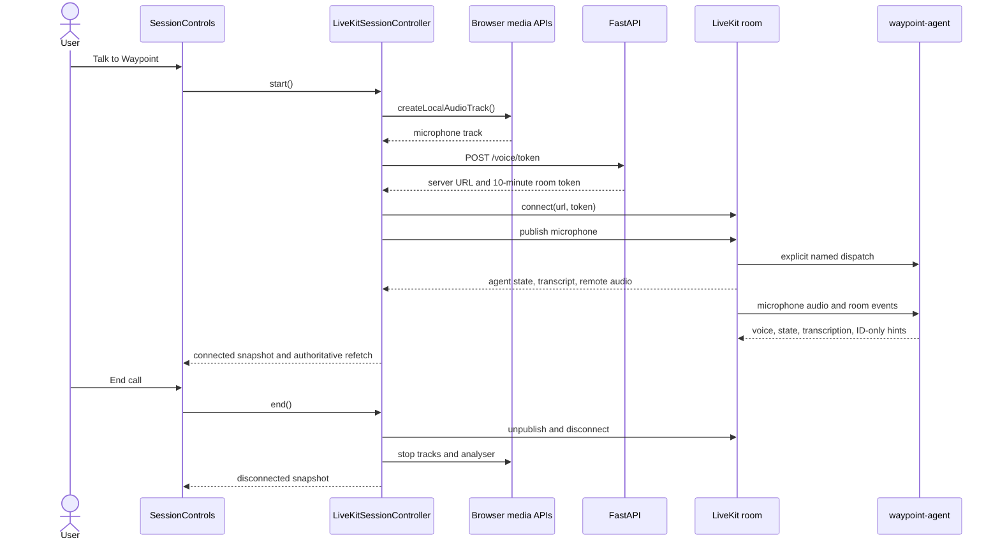
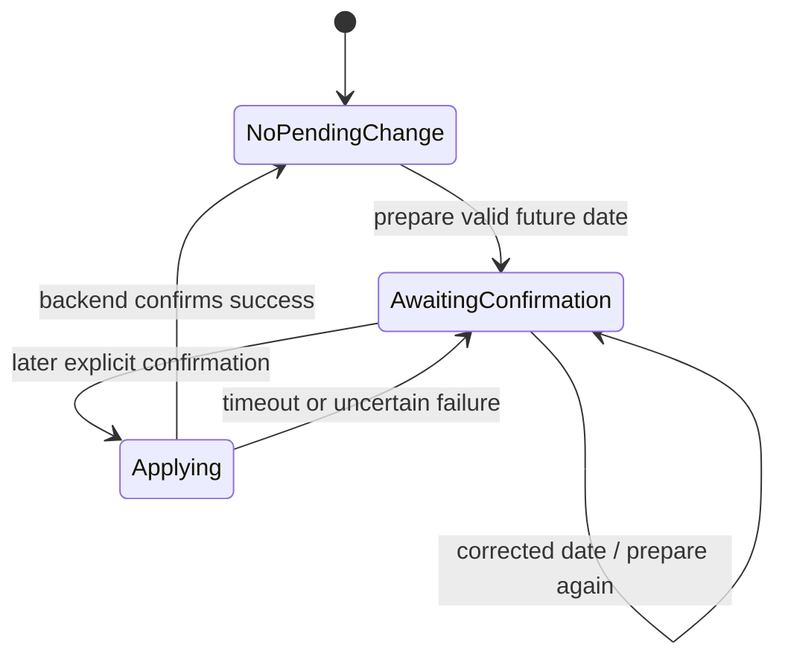
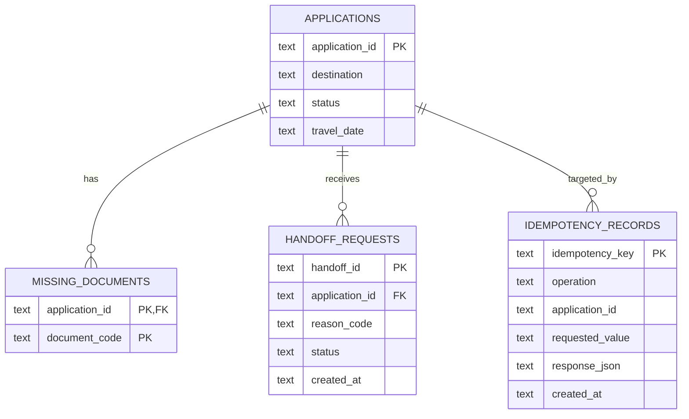

# Architecture

## 1. Architectural goal

Waypoint separates natural conversation from trusted business operations.

- The voice and language-model layer interprets what the traveler means.
- The backend validates operations and owns persistent application state.
- The frontend presents realtime voice state and independently reads authoritative application data.
- The pixel-art world is decorative and never represents tool execution, confirmations, or business progress.

This is a strong V1 shape because each layer has one clear responsibility and the unreliable parts of a voice conversation are prevented from silently becoming business truth.

## 2. Current system topology

The browser, backend, token service, and named agent dispatch are implemented. Human-operated calls through both the custom browser UI and LiveKit's UI exercised microphone/STT, agent audio and state, transcript delivery, application-card refetch, confirmed mutation, end-call cleanup, session restart, and report persistence. Remaining UI acceptance work is limited to a focused narrow viewport, keyboard-only, reduced-motion, and autoplay-fallback pass.

## 3. Three intentionally separate planes

### 3.1 Voice and conversation plane

LiveKit transports microphone audio, remote agent audio, participant attributes, transcription streams, and structured ID-only application messages. The Python agent connects provider services into this pipeline:

Silero VAD determines whether speech is present. LiveKit's turn detector decides whether the user's conversational turn has ended. The agent publishes its official state through the `lk.agent.state` participant attribute; the frontend maps that state to listening, thinking, speaking, and related UI labels.

Preemptive LLM generation is currently disabled. This gives up a small speculative-latency opportunity in exchange for avoiding discarded provider requests when final STT text arrives in multiple chunks; the endpointing bounds are unchanged.

The small `create_llm` helper in `agent.py` fixes the provider order as Gemini followed by Cerebras. LiveKit's fallback adapter moves to Cerebras without retrying Gemini and never retries after streamed text or a tool call has begun, preventing duplicate speech and durable actions.

### 3.2 Business-data plane

Application data travels through ordinary typed HTTP calls. Both the agent and frontend read from FastAPI, and only FastAPI writes SQLite.

The transcript is presentation data only. It is not parsed to obtain an application ID, date, status, or document list for the card.

### 3.3 Decorative visual plane

`PixelJourneyCanvas` owns its own animation loop. It draws stars, clouds, a plane, layered silhouettes, ground, and an original traveler into a low-resolution canvas that is enlarged without smoothing.

The loop is isolated from voice and application state. It uses refs and `requestAnimationFrame`, pauses when the document is hidden, supports a manual pause button, redraws on resize, and renders a static frame when `prefers-reduced-motion: reduce` is active.

This isolation is deliberate: a plane passing or a traveler walking must never imply that a request is processing or that a mutation succeeded.

## 4. Frontend composition and ownership

| Layer | Owns | Does not own |
| --- | --- | --- |
| `WaypointScreen` | Current application ID and composition of the page | LiveKit resources or database records |
| `useApplication` | Loading, ready, not-found, error, abort, and refetch state | Transcript interpretation |
| API/domain adapters | Runtime validation and snake_case-to-domain conversion | React presentation |
| `useVoiceSession` | Stable React subscription to the controller snapshot | Canvas animation |
| `LiveKitSessionController` | Room, microphone, remote audio, events, transcript, cleanup | Application business fields |
| UI components | Accessible controls and presentation | Network or persistence logic |
| `PixelJourneyCanvas` | Decorative animation only | Session or application state |

### Application-card read flow

At load, the current application ID defaults to `VITE_DEFAULT_APPLICATION_ID`, or `APP001` when that variable is absent. The frontend issues both reads in parallel and adapts them into one `ApplicationSnapshot`.

The hook aborts stale requests and ignores late results. It also exposes explicit loading, not-found, and service-error states.

## 5. Browser voice-session lifecycle

The browser implementation is a resource-owning controller outside normal React render cycles. React subscribes to immutable snapshots using `useSyncExternalStore`.

Important resource-safety behavior already exists:

- concurrent start/end requests are serialized;
- an in-flight token request is abortable;
- every failure path clears the connecting state;
- microphone tracks are stopped after failure or disconnect;
- LiveKit listeners and transcription handlers are unregistered;
- remote audio elements and analyser resources are detached;
- reconnecting and unexpected disconnects have explicit UI states;
- browser autoplay blocking surfaces an `Enable audio` control.

## 6. Transcript and audio presence

The frontend consumes LiveKit's `lk.transcription` text stream. It accepts only the local participant as `user` and a LiveKit agent participant as `assistant`. A stable segment ID lets interim text be updated in place, and a finalized segment cannot be replaced by a late interim segment.

Remote agent audio is attached to a hidden audio element. `createAudioAnalyser()` samples only that remote agent track every 80 ms, normalizes the value to `0..1`, and suppresses very small changes before updating React. `SpeakingOrb` receives only the amplitude and UI state, so it can react to sound without learning anything about tools or business operations.

## 7. Agent tools and deterministic confirmation

The agent exposes six tools:

1. `get_application_status`
2. `get_missing_documents`
3. `prepare_travel_date_change`
4. `apply_pending_travel_date_change`
5. `handoff_to_human`
6. `search_support_knowledge`

Application IDs are normalized to the current `APP` plus three-digit format before an application tool is called. General support questions use the local FAQ retriever; application-specific questions use FastAPI.

### Travel-date mutation state machine

`prepare_travel_date_change` verifies the application and future date but does not mutate the backend. It stores the canonical application ID, date, and a generated idempotency key in per-call `WaypointSessionState`.

A separate deterministic listener checks each later completed user turn with a bounded voice-native grammar. Short affirmative or action-bearing phrases can confirm, while negative/correction language, question-shaped input, and any replacement date veto confirmation. Every later user turn recomputes the flag, so “Wait” revokes a prior “Yes.” The LLM instruction alone is not trusted to authorize the mutation. `apply_pending_travel_date_change` refuses to call the backend without both pending state and deterministic confirmation.

When applying, the agent disables interruption around the durable mutation. The backend executes the update and idempotency-record insert in one transaction. On a timeout, pending state and the same idempotency key are retained so a retry cannot create a second logical operation.

After a successful authoritative read or preparation, the agent may publish an `application_context` hint containing only the canonical ID. Only a confirmed successful PATCH produces `application_updated`. The frontend validates the agent, topic, exact keys, type, and ID before refetching FastAPI; signal delivery never carries business fields or changes the authoritative tool result.

### Human-handoff gate

The backend retains all supported handoff reason codes, but the V1 voice agent
is intentionally opt-in: only an explicit request in the latest finalized user
turn can authorize `handoff_to_human`, and the agent must use `user_request`.
The check runs before ID normalization, interruption locking, or HTTP. An
incomplete date, a correction, confusion, or an attempted automatic reason
therefore produces no POST even if the LLM selects the tool incorrectly.

## 8. Backend and persistence

FastAPI initializes SQLite during application lifespan startup. The database lives at `backend/waypoint.db`, is ignored by Git, and contains four tables:

Seed inserts use `INSERT OR IGNORE`, so they create initial synthetic records without overwriting changes in an existing local database.

## 9. Grounding and observability

The FAQ retriever loads `knowledge/faqs.json` once per agent process and applies deterministic lexical scoring: exact-question match, phrase containment, question-token overlap, and curated keyword overlap. It intentionally returns no result below a minimum score so the agent can say it lacks grounded information instead of guessing.

Session observers log available per-turn latency metrics and cumulative model usage. At session end, the agent writes a timestamped, sanitized JSON report under `observability/reports/`. That directory is ignored by Git. The browser transcript itself is not persisted by the React app, but the server-side session report may contain conversation information; production retention and access rules are therefore still required.

## 10. V1 assessment and boundaries

### What works well

- Business truth has a single owner: FastAPI and SQLite.
- Transcript text is isolated from trusted application state.
- The mutation workflow adds deterministic confirmation on top of the LLM prompt.
- Idempotency and transaction boundaries make retries safer.
- LiveKit lifecycle code is outside component render logic and has explicit cleanup.
- Typed runtime adapters reject malformed backend, token, and data-message payloads.
- Decorative animation is isolated and motion-aware.
- Focused tests cover the most important trust boundaries.

Waypoint's V1 architecture gives each layer a clear responsibility:

- FastAPI and SQLite own business truth and durable mutations.
- The agent handles conversation and tool selection but cannot authorize unsafe
  mutations by itself.
- The browser presents realtime state while refetching authoritative data from
  FastAPI.
- Observability records enough evidence to diagnose ordering, latency, usage,
  and shutdown behavior.
- Decorative UI animation remains isolated from business progress.

The project intentionally remains a local synthetic-data prototype. Future work
may include stronger browser automation, additional accessibility QA, more
natural identifier pronunciation, response-length tuning, bundle optimization,
and production security controls if public deployment is ever required.
