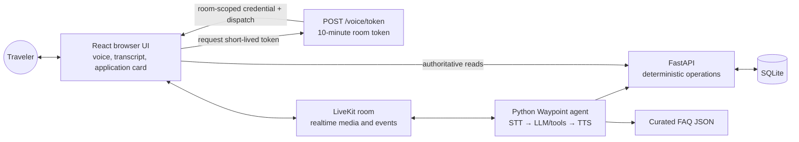

# Waypoint Voice Lab documentation

> Status snapshot: 2026-08-23. These documents describe the audited file state; use the latest Git commit or release tag for the exact revision.

## What Waypoint is

Waypoint Voice Lab is a voice-first travel-support prototype built around a synthetic application domain. A traveler can ask about an application, hear a spoken answer, request a future travel-date change, or ask for human support.

Its central engineering principle is:

> Probabilistic language handles the conversation. Deterministic services own business truth and mutations.

In practical terms, the language model may decide which operation is relevant, but it does not invent application data, directly edit SQLite, or turn transcript prose into trusted UI state. FastAPI validates the request, SQLite stores the record, and the frontend reads the authoritative result.

## Current reality in one minute

The project has three substantial pieces:

1. A FastAPI and SQLite backend with application reads, missing-document reads, idempotent travel-date updates, and durable handoff requests.
2. A LiveKit Python voice agent using Deepgram STT, Groq for tool-calling conversation, Cartesia TTS, deterministic confirmation tracking, grounded FAQ retrieval, and session reporting.
3. A polished Vite, React, and TypeScript browser interface with a real LiveKit client layer, live transcript handling, remote-audio playback and amplitude, authoritative application reads, and a decorative pixel-art journey scene.

The two server-to-client links needed for the first browser conversation are now implemented:

- FastAPI issues unique, 10-minute, room-scoped LiveKit tokens from `POST /voice/token`, with microphone-only publication and explicit dispatch of `waypoint-agent`.
- Successful application tools publish exact, ID-only `application_context` or `application_updated` messages; the browser validates the hint and refetches FastAPI.

The integration has passed focused tests and several human-operated LiveKit Cloud calls through both the custom browser UI and LiveKit's own UI. Those calls exercised microphone/STT, agent audio and state, transcript presentation, ID-driven card refetches, a confirmed travel-date mutation, end-call cleanup, session restart, and report persistence. One custom-UI run exhibited intermittent streamed-audio gaps while a later run and the LiveKit UI were acceptable, so that behavior remains an honest demo risk rather than an unverified transport path. Narrow viewport, keyboard-only, reduced-motion, and autoplay-fallback checks still need a final manual pass.

## How to explain the project

> Waypoint is a reliability-focused voice assistant demo for travel applications. LiveKit carries realtime audio, an agent transcribes and reasons about the request, and typed tools call a deterministic FastAPI service backed by SQLite. Sensitive changes use a prepare-confirm-apply flow and idempotency, while the React UI treats the backend—not the transcript or LLM—as the source of truth.

## System at a glance



The component boundaries and realtime path are implemented and manually exercised for the local synthetic-data V1. The V1 implementation PR is merged and a raw full-flow validation recording exists. The immediate milestone is now the blog, polished video, public links, and a final visual/accessibility pass. Production authentication, origin controls, rate limiting, deployment, and report-retention policy are intentionally deferred unless the project is exposed as a public service.

Making the GitHub source repository public is not the same as deploying that
service. The code can remain public and continue through branches and pull
requests while FastAPI, SQLite, LiveKit sessions, and all provider secrets stay
local.

## Documentation map

| Document | Use it for |
| --- | --- |
| [Architecture](./ARCHITECTURE.md) | Components, ownership boundaries, runtime flows, diagrams, and the V1 architecture assessment |
| [Contracts](./CONTRACTS.md) | HTTP payloads, LiveKit topics and attributes, frontend adapters, database tables, and configuration |
| [Current status](./CURRENT_STATUS.md) | What is implemented, prepared, missing, tested, and currently risky |
| [Local development](./LOCAL_DEVELOPMENT.md) | Setup, processes, expected current behavior, tests, and troubleshooting |
| [Demo guide](./DEMO_GUIDE.md) | Short recording narrative, preflight, acceptance checks, and evidence to capture |
| [Blog preparation](./BLOG_OUTLINE.md) | Suggested article narrative, verified claims, metrics, visuals, and claims to avoid |
| [Integration roadmap](./ROADMAP.md) | Ordered remaining work and acceptance criteria for the next slices |

## Repository map

```text
Waypoint-Voice-Project/
├── agent/                 LiveKit agent, tools, and FAQ retriever
├── backend/               FastAPI service, SQLite initialization, API tests
├── evals/                 Deterministic checks and provider-backed agent-flow evals
├── frontend/              Vite + React + TypeScript browser client
├── knowledge/             Curated grounded FAQ corpus
├── observability/         Session metrics and end-of-session report writer
├── tests/                 Workflow safety, signal, and observability tests
├── docs/                  Project documentation (this directory)
├── pyproject.toml         Direct Python dependency specification
├── uv.lock                Locked Python environment
└── requirements.txt       Fully pinned Python environment snapshot
```

## Status language used in these docs

- **Implemented**: code exists and its focused automated checks pass.
- **Manually exercised**: a human completed the path against real local processes and LiveKit Cloud; this is useful evidence but not a repeatable automated guarantee.
- **Prepared**: the receiving interface and types exist, but a required producer or server endpoint does not.
- **Missing**: required code is not present in this repository snapshot.
- **Not verified end to end**: individual layers exist, but the complete live path has not been exercised together.

## Recommended context for a future chat

For a quick handoff, give a future chat these three files first:

1. This document.
2. [Current status](./CURRENT_STATUS.md).
3. [Architecture](./ARCHITECTURE.md).

Then include [Contracts](./CONTRACTS.md) when the next task touches integration code. The status date and commit should be updated whenever a major slice lands so future chats can distinguish current facts from historical plans.
