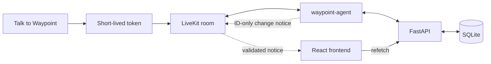
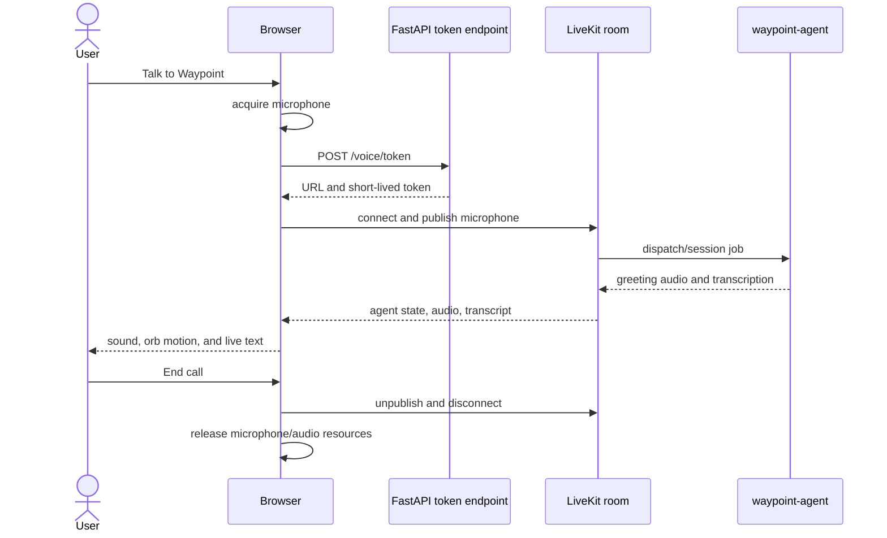
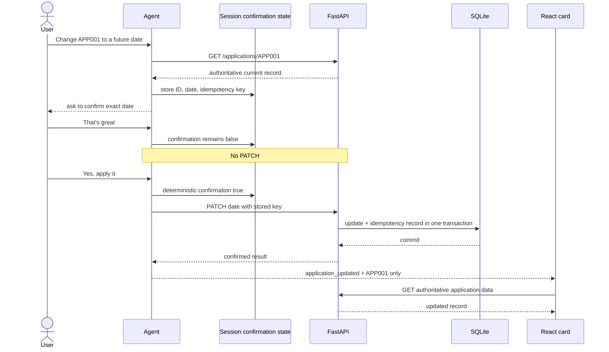

# Portfolio completion roadmap

## Goal of the next milestone

The integrated local browser conversation is implemented and has been manually exercised. The next milestone is a reviewable, portfolio-ready evidence package:



The existing architecture should now be demonstrated and documented, not redesigned.

Status on 2026-08-23: the token endpoint and agent signal publisher are implemented, their focused tests pass, and human-operated custom-UI and LiveKit-UI calls exercised microphone/STT, agent audio/state/transcript, application context and card refetch, confirmed date mutation, end-call cleanup, restart, and report persistence. The remaining Priority 0 work is a clean scripted recording, final evidence checks, coherent commits, and the small residual visual/accessibility pass.

## Priority 0 — completed integration foundations

### 1. Implement `POST /voice/token` — complete

Owner: backend integration slice.

Required behavior:

1. Read LiveKit credentials only on the server.
2. Generate a unique browser participant identity and room name, or safely reuse an explicitly selected room policy.
3. Mint a short-lived participant token with only the grants the browser needs.
4. Arrange dispatch of the registered agent name `waypoint-agent` into that room.
5. Return the exact current frontend contract:

```json
{
  "server_url": "wss://example.livekit.cloud",
  "participant_token": "<short-lived token>",
  "room_name": "waypoint-...",
  "participant_identity": "browser-..."
}
```

6. Return controlled errors without exposing secrets or provider details.
7. Add focused endpoint tests for response shape, uniqueness, failure handling, and secret non-disclosure.

Important decisions:

- Use the installed/current LiveKit server SDK API rather than hand-building a JWT.
- Do not place `LIVEKIT_API_SECRET` or a reusable token in frontend code or Vite environment variables.
- Keep the endpoint contract named `participant_token`; changing it requires a coordinated frontend change.
- An unauthenticated local endpoint can unblock the synthetic V1, but it must be clearly limited to local development. Authentication, authorization, origin checks, and rate limits are required before public exposure.

Acceptance criteria:

- `POST /voice/token` returns a valid short-lived token.
- The token joins only the intended room with a generated browser identity.
- `waypoint-agent` is dispatched and appears as an agent participant.
- A token/server error returns the UI to a retryable state and releases the microphone.
- No secret appears in the built frontend, browser network source, logs, or committed files.

### 2. Verify the first live browser call — manually exercised

Owner: integration/QA slice after the token endpoint.

Run all three processes:

```text
FastAPI
lk agent dev agent/agent.py
Vite
```

Verify this sequence:



Acceptance criteria:

- Voice-link status reflects the real room connection.
- The official agent state drives listening/thinking/speaking labels.
- Remote audio is audible or the browser exposes `Enable audio`.
- The orb moves from remote agent amplitude, not a timer.
- User and assistant transcripts appear without duplicate final lines.
- End call stops the microphone and returns to disconnected state.
- Repeated start/end actions do not leak tracks or leave the UI connecting.

## Priority 0 — complete authoritative application refresh

### 3. Add a small agent-side data-message publisher — complete

Owner: agent integration slice.

Publish on this LiveKit topic:

```text
waypoint.application
```

Only these exact payloads are allowed:

```json
{
  "type": "application_context",
  "application_id": "APP001"
}
```

```json
{
  "type": "application_updated",
  "application_id": "APP001"
}
```

Recommended semantics:

- Publish `application_context` after an application-specific tool has returned an authoritative record or verified ID.
- Publish `application_updated` only after FastAPI confirms a state-changing operation, initially the travel-date update.
- Do not publish status, destination, travel date, missing documents, success prose, or arbitrary transcript text.
- Treat delivery as a UI refresh hint. A notification failure must be logged, but it must not rewrite the already-confirmed backend result.

The frontend receiver already:

- checks the sender is an agent;
- checks the topic;
- validates UTF-8, size, exact keys, type, and ID;
- changes/refetches the current application;
- ignores business fields and malformed messages.

Acceptance criteria:

- Asking about `APP004` switches the card context to `APP004` after the agent signal.
- A successful confirmed update for `APP001` triggers a FastAPI refetch.
- The card renders the value returned by FastAPI, not the data message.
- A malformed or extra-field message is ignored.
- No event is sent before the backend confirms a mutation.

### 4. Verify the complete mutation story — deterministic and manual coverage complete

Test this exact conversation behavior:

1. User requests a new future date with an explicit year.
2. Agent calls `prepare_travel_date_change`.
3. Agent reads back the exact application and date and asks for confirmation.
4. User says something vague such as “That's great.”
5. No patch occurs.
6. User naturally but explicitly says “Yeah, please change it.”
7. Agent calls `apply_pending_travel_date_change` with the stored idempotency key.
8. FastAPI commits the update and idempotency record.
9. Agent publishes `application_updated` with only the ID.
10. Browser refetches FastAPI and shows the new date.



Also test a timeout/retry path and confirm the same idempotency key is reused.

## Priority 0 — publish the source repository

A public GitHub repository does not deploy the unauthenticated local runtime.
Development can continue publicly through branches and pull requests while
FastAPI, SQLite, LiveKit sessions, and provider credentials remain local.

Before changing repository visibility:

1. Resolve ownership/provenance for `frontend/ui-inspo/waypoint-frontend-inspo`. If it is unlicensed third-party material, remove it from public history rather than only deleting the current file.
2. Choose a license, or consciously publish without one and retain default all-rights-reserved terms.
3. Review and merge the focused backend, agent/evaluation, and documentation commits.
4. Repeat the secret/generated-artifact scan and confirm no environment file, SQLite database, report, recording, cache, token, or build output is staged or tracked.

## Priority 0 — complete the portfolio package

These items may be completed after the source repository is public:

1. Reset or verify the synthetic demo records, warm all three processes, and complete the short flow in [the demo guide](./DEMO_GUIDE.md).
2. Record a 60–90 second video showing application status/context switching, one-confirmation date mutation, authoritative card refresh, explicit human handoff, and clean End call. Missing-document support can appear in a longer cut or the written capability/evaluation table.
3. Capture one architecture image or Mermaid rendering, one polished product screenshot, a concise evaluation table, and the final video link in the root README/case study.
4. Perform the remaining narrow viewport, keyboard-only, reduced-motion, and autoplay-fallback checks. Record any unresolved intermittent audio-streaming behavior as a limitation.

The first complete take has been captured locally with audio, live card updates,
the confirmed mutation, explicit handoff, and clean disconnect. Review and trim
that take before upload; a new recording is optional rather than a functional
V1 requirement.

### V1.1 voice polish

- Add a LiveKit-compatible TTS-only text formatter so canonical transcript IDs
  remain `APP004` while synthesis consistently receives "A P P zero zero four."
- Continue shortening long knowledge and handoff responses where provider
  wording exceeds the one-sentence default.
- Exercise barge-in deliberately; the final V1 call did not include an
  interrupted assistant turn.

The current verification snapshot is green: 145 provider-free Python tests,
seven Groq-backed agent-flow evals with every real tool safely mocked, ten
frontend tests, TypeScript checking, and the Vite production build.

## Priority 1 — make the integration dependable

### Automated browser integration tests

The real flow now works manually. Add a small browser test layer only if repeatable transport/UI regression coverage is worth the additional harness complexity. High-value cases:

- application card load and API failure;
- token endpoint failure releases the microphone;
- connect/end-call lifecycle;
- transcript interim-to-final replacement;
- strict application-event rejection;
- successful event causes an authoritative refetch;
- reduced motion and essential keyboard navigation.

Use mocks or a local LiveKit test strategy for most CI tests, with a separately labeled provider-backed smoke test.

### Backend structure

The current single route module is understandable for V1. As endpoints grow, split it into:

```text
backend/app/
├── main.py              app creation and router inclusion
├── routes/
│   ├── applications.py
│   └── voice.py
├── services/
│   ├── applications.py
│   └── livekit_tokens.py
└── repositories/
    └── applications.py
```

Do this when it reduces real duplication; it is not required to unblock the first call.

### Agent HTTP boundary

Centralize repeated backend request, timeout, JSON, and status handling. Preserve tool-specific user-safe errors and never turn an uncertain result into claimed success.

### Frontend bundle

The production build passes, but LiveKit contributes to a `722.71 kB` minified initial JS chunk. Consider lazy-loading the voice session implementation when the user starts a call. Measure startup and interaction performance before deciding how much optimization is justified.

### Stable fixtures

Fixed seed dates in 2026 will eventually be in the past. Move test/demo dates to controlled fixtures or generate them relative to a fixed test clock while retaining deterministic expectations.

## Priority 1 — security and privacy before public use

These are not optional for real traveler data:

1. Authenticate the browser user.
2. Authorize that user for each application ID on every read and mutation.
3. Bind token issuance and room participation to that identity.
4. Use short token TTLs and minimum LiveKit grants.
5. Add origin/CSRF strategy, request rate limits, abuse controls, and audit logs.
6. Store secrets in a deployment secret manager and rotate them.
7. Use TLS throughout and define production proxy/CORS behavior.
8. Define transcript/session-report retention, redaction, deletion, and access policies.
9. Avoid recording raw sensitive audio unless there is a reviewed requirement and consent path.
10. Add database migration and backup strategy before SQLite schema changes become operationally important.

## Priority 2 — evaluation and product maturity

- Add scenario coverage for interruptions during confirmation, corrections, timeouts, duplicate retries, and backend conflicts.
- Separate deterministic CI checks from provider-backed behavioral evals in scripts and reporting.
- Record eval model/version and date so behavior changes are explainable.
- Improve retrieval only when the FAQ corpus outgrows deterministic lexical search; do not add a vector database preemptively.
- Add structured observability correlation across room, participant, tool request, application ID, and backend operation without logging secrets.
- Add deployment health checks and a small operator runbook.
- Revisit settings, authentication UI, history, or multi-page navigation only after the core voice workflow proves useful.

## Explicitly out of scope for the current milestone

- login UI or full identity product design;
- admin pages or a debug dashboard;
- persistent browser transcript/history;
- frontend business mutations;
- deriving application fields from assistant prose;
- decorative animation linked to tool calls or progress;
- replacing the cinematic interface with a generic dashboard;
- expanding into bookings, cancellations, uploads, or unsupported airline policy.

## Completion definition

The local integration milestone is complete when all of the following are true:

- [x] FastAPI returns a secure short-lived token from `POST /voice/token`.
- [x] The response matches `participant_token` and the current frontend parser.
- [x] The token flow dispatches `waypoint-agent`.
- [x] Browser microphone audio reaches the agent and produces finalized STT.
- [x] Agent speech, official state, and transcript reach the browser.
- [x] End call closes the session/media path and a subsequent session can start cleanly.
- [x] Agent sends only validated ID-only application signals.
- [x] The browser refetches FastAPI after context/update signals.
- [x] A vague response cannot authorize a date mutation.
- [x] An explicit confirmation can produce one idempotent backend update.
- [x] The application card shows the backend-confirmed result.
- [x] Focused Python and frontend tests pass.
- [x] One desktop viewport is manually inspected.
- [ ] Narrow viewport, keyboard-only, reduced-motion, amplitude-orb, and autoplay-fallback behavior receive a final focused pass.
- [x] Documentation status and contracts are updated to remove the completed blockers.
