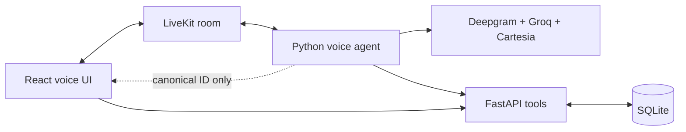

# Waypoint Voice Lab — Engineering case study

## Summary

Waypoint is a realtime voice-support prototype built to demonstrate reliable
agent workflows rather than a broad travel product. A traveler can ask about a
synthetic application, check missing documents, change a future travel date,
or request human support through speech.

The central design decision is that the language model selects and explains
actions, while deterministic Python, FastAPI, and SQLite decide whether those
actions are valid and whether durable state may change.

## The engineering problem

A voice agent has several probabilistic boundaries at once:

- speech may be segmented or transcribed imperfectly;
- the LLM may choose the wrong tool or take multiple tool steps in one turn;
- network and provider latency can make otherwise-correct speech feel broken;
- a fluent response can hide an incorrectly ordered side effect;
- frontend transcript text is not trustworthy business state.

Waypoint was designed to make those failure modes visible, testable, and
recoverable.

The local V1 is functionally complete: its full browser voice path, guarded
mutation, explicit handoff, application-card refresh, observability, and clean
disconnect have been exercised in a recorded session.

## System design

Three data planes remain intentionally separate:

1. **Realtime conversation:** LiveKit transports microphone audio, agent audio,
   transcript events, and agent state.
2. **Business data:** typed HTTP endpoints validate reads and mutations; SQLite
   is the source of truth.
3. **UI synchronization:** the agent publishes only a canonical application ID;
   the browser refetches FastAPI before rendering an update.

## Reliability mechanisms

### Prepare, confirm, apply

A date change is split into two tools. Preparation verifies the application and
future date and stores a proposal plus an idempotency key in session state. A
later finalized user turn must pass a conservative deterministic confirmation
classifier before the apply tool can call FastAPI.

Natural confirmations such as “Yeah, please change it” are accepted. Vetoes,
questions, vague acknowledgements, and replacement dates are rejected. A
correction prepares a new proposal and clears earlier consent.

### Explicit opt-in handoff

The backend retains a complete handoff reason enum, but the V1 voice agent may
create a request only when the latest finalized user turn explicitly asks for
a human. The gate runs before identifier normalization, interruption locking,
or HTTP. Missing dates, confusion, corrections, and automatic escalation
reasons therefore produce no side effect.

The deterministic grammar scopes negation to the handoff request rather than
rejecting any sentence containing “not.” It accepts natural requests such as
“This is not working; connect me to a human,” while rejecting negated requests
and informational speech such as “I want to know what a support agent does.”

### Idempotent durable updates

FastAPI applies the travel-date update and stores its idempotency result in one
transaction. Retrying the same logical operation returns the recorded result;
reusing its key for a different request conflicts.

### Grounded reads and frontend trust

Current application facts always come from application tools. General support
answers use a curated local FAQ retriever. The frontend never derives status or
dates from assistant prose or LiveKit data messages; it validates an ID-only
hint and refetches the API.

### Observable sessions

The agent records turn metrics, tool calls, usage, state transitions, chat
history, and shutdown reason through current LiveKit Agents 1.7 APIs. Reports
are formatted JSON, ignored by Git, and written defensively so shutdown cannot
fail because reporting failed.

## Failures found through real calls

### Mutation happened before the spoken confirmation

In an early recorded session, `prepare_travel_date_change` returned
`confirmation_required`, but Groq immediately called the apply tool in the same
LLM/tool loop. SQLite changed before the assistant asked “Is that correct?”

The fix was not merely another prompt sentence. Session state now records
deterministic confirmation, preparation resets it, and the apply tool refuses
to open the HTTP mutation unless a later finalized turn grants consent.

### Safe flow became too rigid

An exact phrase allowlist caused natural speech such as “Yes. Confirmed.” to be
rejected and encouraged double confirmation. The classifier was replaced with
a bounded voice-native grammar: affirmative/action intent is accepted, while
negative language, corrections, questions, and date-like replacements veto it.

The prompt was also consolidated substantially and made explicit about
preparing before asking exactly one confirmation.

A later provider-backed eval exposed one more prompt-adherence failure: despite
receiving a complete month, day, and four-digit year, the model asked for the
year or confirmation before preparation. The eval now prints tool calls and
assistant text on failure, uses a future date derived from the current day, and
the tool guidance defines preparation as mandatory non-mutating validation.

### Incomplete date caused an unnecessary handoff

A real LiveKit-UI call produced `handoff_to_human(...,
repeated_clarification_failure)` on the first incomplete date request. Because
handoff creation is durable, prompt guidance alone was insufficient. The V1
agent now accepts only `user_request`, backed by a deterministic classifier of
the latest finalized transcript. Tests prove rejected attempts cause zero HTTP
calls and zero interruption locks.

### Choppy audio required separating lifecycle from streaming

One custom-UI session produced 20.72 seconds of Cartesia audio but occupied
32.08 seconds of speaking time. Reports showed that the previous room had
closed cleanly and the new session used a different job and room, ruling out a
leaked call. A nearby LiveKit-UI run was substantially smoother, while two
false interruption/resume events explained some perceived pauses.

The result was a narrower diagnosis: intermittent provider/WebRTC/browser
streaming remained possible, but session cleanup was not the cause. This is
exactly why transport, provider, and application metrics are reported
separately.

## Verification evidence

Snapshot date: 2026-08-23.

| Evidence | Result |
| --- | --- |
| Provider-free Python suite | 145 passed |
| Groq-backed agent-flow evals | 7 passed on the latest complete run |
| Frontend tests | 10 passed across 3 files |
| TypeScript check and Vite production build | Passed |
| Backend tests | Temporary SQLite through FastAPI lifespan; development DB untouched |
| Real browser calls | Microphone/STT, audio, transcript/state, application context, confirmed update, and clean disconnect exercised |

In the final recorded call, seven measured assistant turns had `1.849s` median
and `1.959s` maximum end-to-end latency. Median steady-state LLM first-token
latency was `0.471s`, and median TTS first-audio latency was `0.094s`. The
longer perceived delay came mainly from response speech duration, so these are
diagnostic figures from one call rather than benchmark claims.

Provider-backed behavior is measured separately from deterministic safety
invariants. An earlier complete-date routing miss remains documented as a
failure found by the eval; the final complete run passed after targeted
prepare-first guidance, without retries or weaker assertions.

## Tradeoffs

- Preemptive generation is disabled for the current free-tier Groq setup to
  avoid discarded speculative requests. This favors predictable quota use over
  the lowest possible response-start latency.
- SQLite and synthetic records keep the demo understandable. They are not a
  substitute for authenticated, authorized production storage.
- Reports are local and useful for engineering, but they may contain transcript
  content and require a real retention/redaction policy before deployment.
- A recorded local demo is the delivery target. Public hosting is intentionally
  deferred because it would require authentication, authorization, rate limits,
  origin controls, secret management, TLS, and abuse prevention.
- A public source repository is separate from public hosting. Development can
  continue openly through reviewed branches while every runtime service remains
  local and synthetic.
- Canonical IDs remain `APP004` in tools and transcripts. A deterministic
  TTS-only formatter for more natural spoken IDs is useful V1.1 polish, not a
  prerequisite for the validated V1 workflow.

## What this project demonstrates

- Building a realtime STT → LLM/tools → TTS application with LiveKit.
- Designing deterministic safety boundaries around probabilistic tool routing.
- Implementing idempotent mutations and isolated database tests.
- Connecting voice state to a typed React UI without trusting model prose.
- Diagnosing real call failures from latency, usage, state, and tool traces.
- Separating deterministic CI from provider-backed behavioral evaluation.

## Resume-ready summary

- Built a realtime LiveKit voice-support application using Deepgram STT, Groq
  tool routing, Cartesia TTS, FastAPI, SQLite, React, and TypeScript.
- Designed deterministic confirmation and explicit-handoff gates that prevent
  premature or unintended durable side effects even when the LLM selects an
  unsafe tool.
- Added idempotent transaction handling, temporary-database backend tests,
  provider-backed conversation evals, and session-level latency/usage reports
  used to diagnose failures from real calls.

See [the README](./README.md) for setup and repository navigation, and
[the architecture document](./docs/ARCHITECTURE.md) for the detailed system
boundaries.
